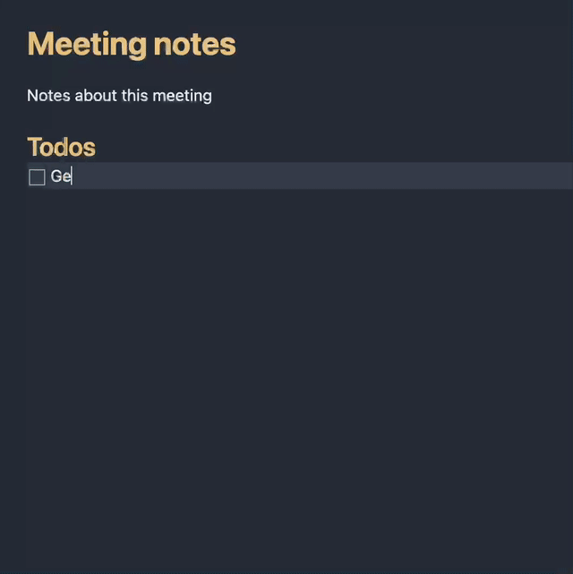

# Obsidian Mention Suggester

Associate trigger characters (like '@') with a query (like '#person') to show an autocomplete for adding links to commonly-referenced notes.

## Demo



## Installation instructions

This plugin is not yet on the Community Plugin list so you will have to install it manually.

### Manual installation

Run `git clone git@github.com:hyfen/obsidian-mention-suggester.git` in `[VAULT_ROOT]/.obsidian/plugins`

## Development instructions

```sh
npm install
npm run dev
```

## About
This plugin was developed by [Andrew Louis](https://hyfen.net). 

<a href="https://www.buymeacoffee.com/hyfen" target="_blank"></a>